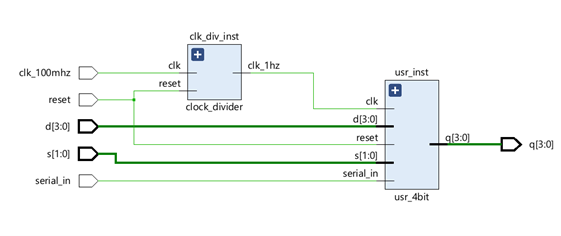
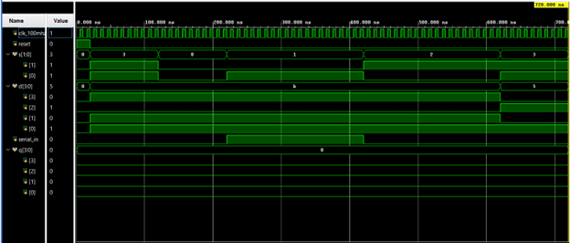

# 4-Bit Universal Shift Register

## Overview

This project implements a **4-bit Universal Shift Register (USR)** in SystemVerilog. The design supports four operating modes: **Hold**, **Shift Right**, **Shift Left**, and **Parallel Load**. A clock divider is used to reduce the FPGA's 100 MHz system clock to a 1 Hz clock, allowing the register operations to be observed visually on LEDs.

## Features

* 4-bit data storage
* Parallel data loading
* Left shift operation
* Right shift operation
* Hold (no change) operation
* Asynchronous reset
* 1 Hz clock generation for FPGA demonstration

## Design Architecture

### Top Module (`top_usr`)

The top-level module connects:

1. A clock divider that converts the 100 MHz FPGA clock to 1 Hz.
2. The 4-bit universal shift register.

### Inputs

| Signal       | Width | Description                       |
| ------------ | ----- | --------------------------------- |
| `clk_100mhz` | 1     | FPGA system clock                 |
| `reset`      | 1     | Active-high reset                 |
| `s`          | 2     | Mode selection                    |
| `d`          | 4     | Parallel input data               |
| `serial_in`  | 1     | Serial input for shift operations |

### Outputs

| Signal | Width | Description     |
| ------ | ----- | --------------- |
| `q`    | 4     | Register output |

## Mode Selection

| s[1:0] | Operation          |
| ------ | ------------------ |
| 00     | Hold Current Value |
| 01     | Shift Right        |
| 10     | Shift Left         |
| 11     | Parallel Load      |

## Operation

### Hold Mode (00)

The register maintains its current contents.

### Shift Right Mode (01)

All bits shift one position to the right. The serial input is inserted into the most significant bit (MSB).

### Shift Left Mode (10)

All bits shift one position to the left. The serial input is inserted into the least significant bit (LSB).

### Parallel Load Mode (11)

The 4-bit input data `d` is loaded directly into the register.

## Testbench Verification

The testbench verifies the following operations:

1. System reset
2. Parallel loading of data `1011`
3. Hold operation
4. Right shift operation with serial input = 1
5. Left shift operation with serial input = 0
6. Parallel loading of data `0101`

## Simulation Notes

The design uses a 1 Hz clock generated from the FPGA's 100 MHz clock. While this is suitable for hardware demonstration, it significantly slows simulation because one output update occurs every second. For faster simulation, the clock divider can be bypassed and the shift register can be driven directly by the testbench clock.

## Results

Simulation confirms correct operation of all four modes:

* Parallel Load
* Hold
* Shift Right
* Shift Left

The RTL schematic and waveform results verify that the register responds correctly to control inputs and clock transitions.

## Conclusion

The implemented 4-bit Universal Shift Register successfully demonstrates multiple data movement operations using a single register structure. The integration of a clock divider enables easy observation of register behavior on FPGA hardware while maintaining correct sequential logic functionality.
